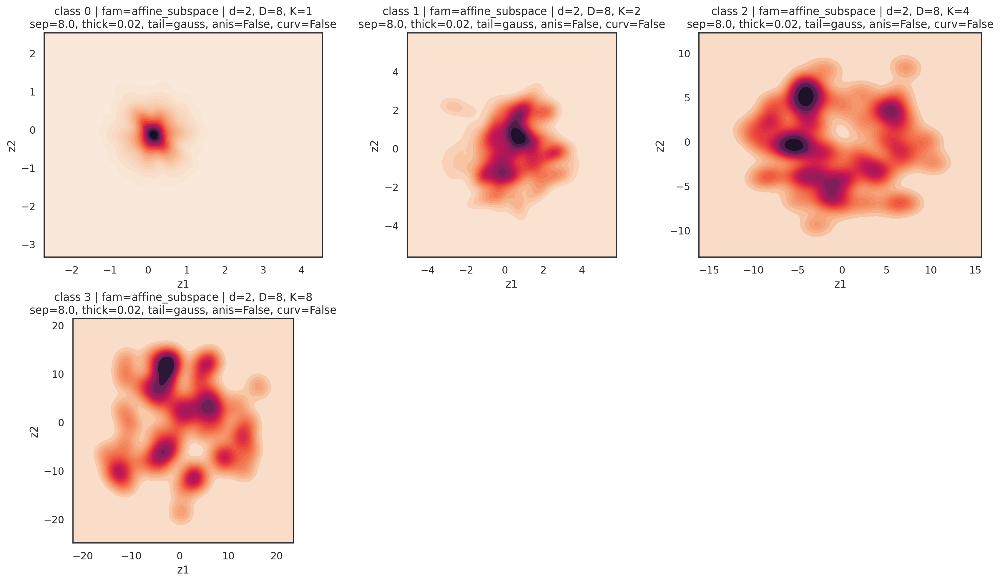
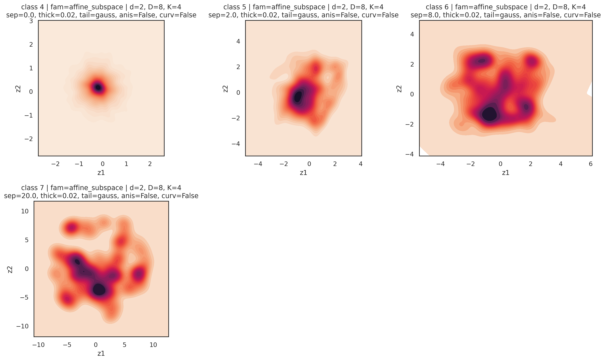
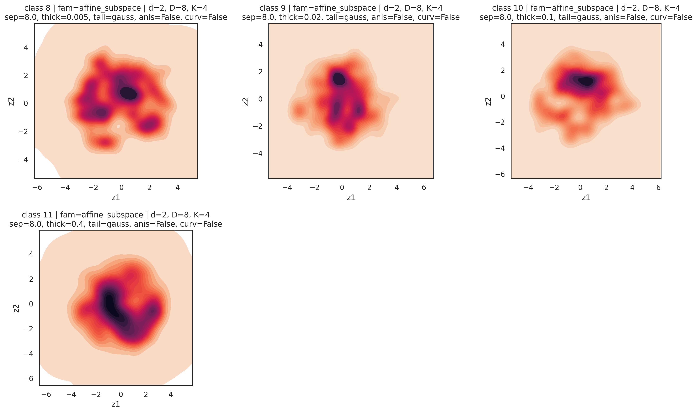
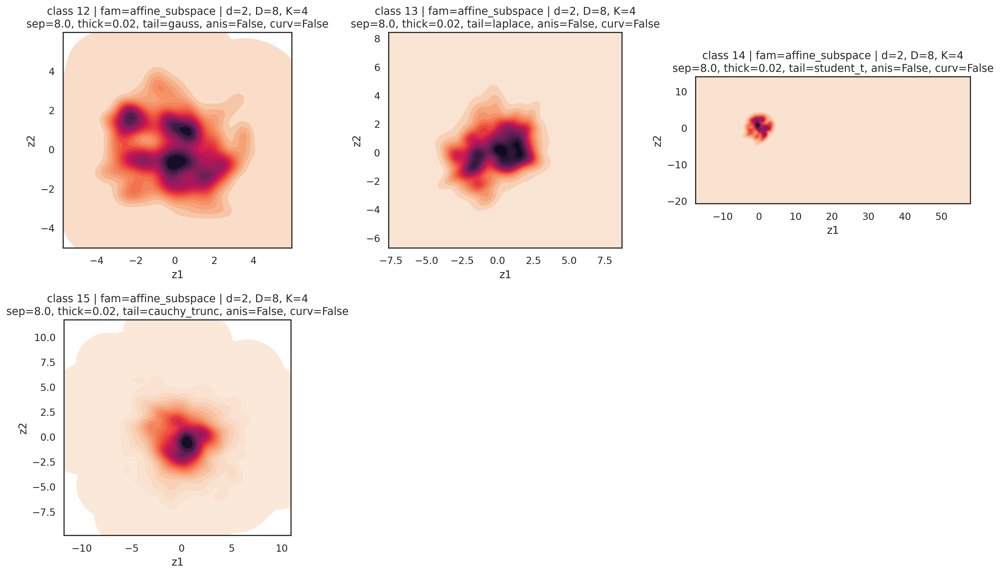
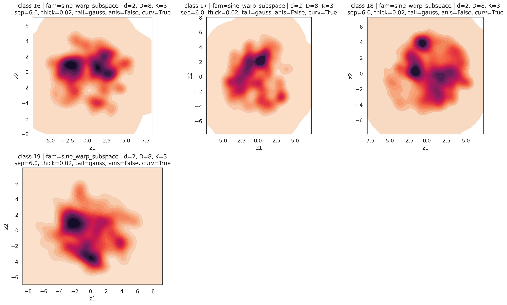
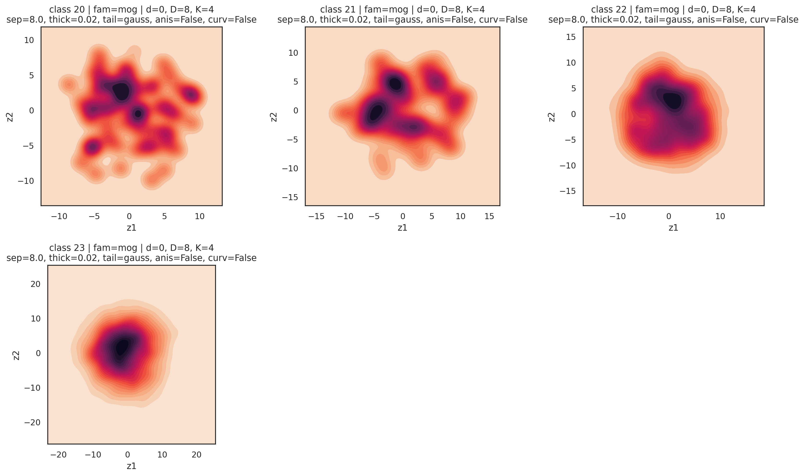
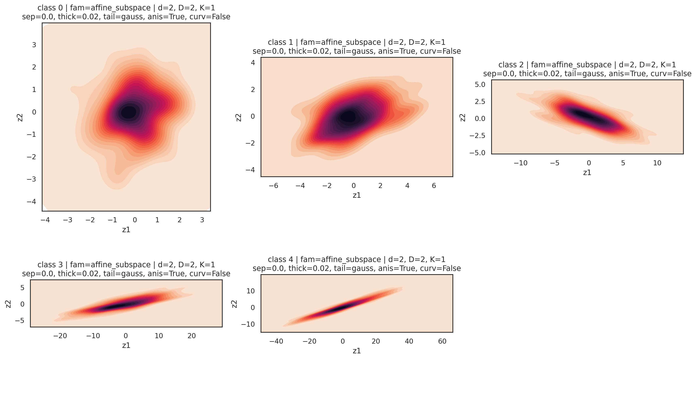

# Synthetic Geometric Dataset: Attributi, Sweep e Visualizzazione

Questa pagina documenta il dataset sintetico usato per lo studio della diffusability in `datamodules/synthetic_pointclouds.py` e come configurarlo via Hydra.

## 1) Idea del dataset

Ogni sample e' un singolo vettore `x in R^D` con label di classe `y`.

- `D` = dimensione ambientale
- la classe `y` seleziona i parametri geometrici (`ClassParams`)
- ogni classe puo' essere generata da una famiglia diversa (`affine_subspace`, `sine_warp_subspace`, `mog`)
- la geometria globale della classe viene fissata una volta per classe; tra sample cambiano variabili latenti, componente di mixture e rumore

### Famiglie supportate

- `affine_subspace`: campioni su sottospazio affine con rumore di spessore.
- `sine_warp_subspace`: come affine, ma con warp sinusoidale nelle coordinate intrinseche.
- `mog`: mixture of Gaussians in spazio ambientale.

## 2) Attributi configurabili

I parametri stanno in `conf/data/synth_pc*.yaml`, nella sezione `cfg`.

### 2.1 Parametri dataset-level (`DatasetConfig`)

- `num_samples`: numero totale di sample se `samples_per_class=null`.
- `points_per_cloud`: campo legacy, mantenuto solo per compatibilita'; il dataset restituisce comunque singoli vettori.
- `base_seed`: seed deterministico base per il campionamento dei sample.
- `geometry_seed`: seed separato per fissare la geometria globale di ciascuna classe.
- `device`: tipicamente `cpu` per generazione dataset.
- `samples_per_class`: se impostato, forza dataset bilanciato per classe.
- `classes`: mappa esplicita `class_id -> ClassParams`.
- `class_sweeps`: griglie parametriche espanse automaticamente in classi.

### 2.2 Parametri classe (`ClassParams`)

- `family`: `affine_subspace | sine_warp_subspace | mog`.
- `d`: dimensione intrinseca.
- `D`: dimensione ambientale (tipicamente `${ambient_dim}`).
- `K`: numero di componenti/modi della mixture.
- `separation`: distanza tra modi.
- `thickness`: spessore/rumore additivo isotropo (manifold thickness).
- `mode_weights`: pesi della mixture (uniforme se `null`).
- `mog_diag_cov`: scala base della covarianza diagonale (solo `mog`).

#### `tail` (distribuzione intrinseca)

- `tail.kind`: `gauss | laplace | student_t | cauchy_trunc`
- `tail.student_df`: gradi di liberta' per `student_t`
- `tail.cauchy_clip`: clipping per `cauchy_trunc`

#### `anisotropy`

- `anisotropy.enabled`: abilita scaling anisotropo sulle coordinate intrinseche.
- `anisotropy.min_scale`: scala minima.
- `anisotropy.max_scale`: scala massima.
- `anisotropy.permute_per_mode`: permuta assi per modo (se utile).

#### `curvature`

- `curvature.enabled`: abilita warp sinusoidale (famiglia `sine_warp_subspace`).
- `curvature.alpha`: ampiezza warp.
- `curvature.freq`: frequenza warp.

## 3) Come modificare i parametri

### 3.1 Modifica YAML

File tipico: `conf/data/synth_pc.yaml`.

Esempio sweep anisotropy:

```yaml
class_sweeps:
  - name: sweep_affine_anis
    base:
      family: affine_subspace
      d: 2
      D: ${ambient_dim}
      K: 1
      separation: 0.0
      thickness: 0.02
      tail:
        kind: gauss
      anisotropy:
        enabled: true
        min_scale: 1.0
        max_scale: 1.0
        permute_per_mode: false
      curvature:
        enabled: false
    sweep:
      anisotropy.max_scale: [1.0, 2.0, 4.0, 8.0, 16.0]
```

### 3.2 Override da CLI (Hydra)

Esempio run singolo:

```bash
uv run python SiT/train.py \
  data.dataset.cfg.class_sweeps[0].base.K=4 \
  data.dataset.cfg.class_sweeps[0].sweep.separation=[2.0,8.0,20.0]
```

## 4) Sweep training: modello multi-classe vs 1 classe per run

### A) Un solo training multi-classe

- Configuri liste in `class_sweeps`.
- Ogni combinazione diventa una classe nello stesso run.
- `model.num_classes` viene auto-risolto dal datamodule.

### B) Un training per classe (consigliato per isolamento causale)

Usa Hydra multirun facendo sweep su valori scalari (uno per run). In ciascun run, lo sweep interno diventa di fatto 1 sola classe.

Esempio (5 run, uno per valore di anisotropy):

```bash
uv run python SiT/train.py -m \
  data.dataset.cfg.class_sweeps[0].sweep.anisotropy.max_scale=1.0,2.0,4.0,8.0,16.0
```

Perche' funziona: `_expand_class_sweeps` tratta valore scalare come lista con un solo elemento nel run corrente.

## 5) Plot: come funziona `utils/plot_distribution.py`

Pipeline:

1. istanzia dataset da config Hydra;
2. raccoglie sample per classe (`max_points_per_class`);
3. proietta in 2D (`projection = pca | dims`);
4. plot KDE per classe;
5. salva immagine (crea automaticamente le directory parent).

Parametri principali in config plot:

- `plot.max_points_per_class`
- `plot.projection`
- `plot.dim0`, `plot.dim1`
- `plot.kde_levels`, `plot.kde_thresh`, `plot.cmap`
- `plot.num_workers`
- `plot.out_name`

## 6) Comandi usati per generare i plot documentativi

```bash
.venv/bin/python utils/plot_distribution.py --config-name plot_dataset_docs
.venv/bin/python utils/plot_distribution.py --config-name plot_dataset_docs_anis
```

Config usate:

- `conf/plot_dataset_docs.yaml`
- `conf/plot_dataset_docs_anis.yaml`
- `conf/data/synth_pc_doc_sweeps.yaml`
- `conf/data/synth_pc_doc_anis.yaml`

## 7) Galleria immagini (sweep)

### Sweep su numero modi `K`



### Sweep su separazione tra modi



### Sweep su thickness



### Sweep su tail distribution



### Sweep su curvature (sine warp)



### Sweep su covarianza MoG



### Sweep su anisotropy (single-class view)



## 8) Lettura qualitativa rapida dei parametri

- `K`: aumenta il numero di regioni ad alta densita' (modi).
- `separation`: allontana i modi.
- `thickness`: aumenta lo spessore/blur della distribuzione.
- `tail.kind`: controlla code e outlier.
- `anisotropy.max_scale`: aumenta l'elongazione lungo assi intrinseci.
- `curvature.alpha`: aumenta la non linearita' della manifold.
- `mog_diag_cov`: allarga/restringe i blob nella famiglia MoG.
